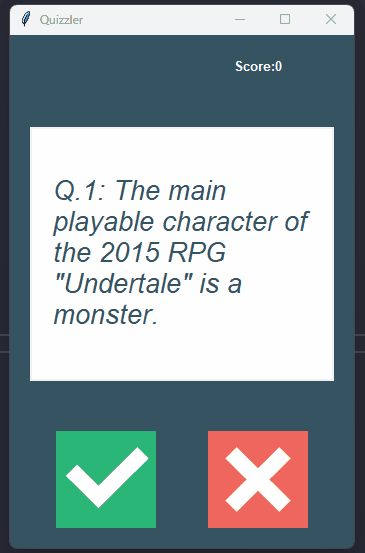

🧠 Quizzler - Quiz App (Python + Tkinter)
____
Quizzler is a simple quiz application built using Python and Tkinter.  

It fetches trivia questions from the [Open Trivia Database](https://opentdb.com/) API and lets the user answer True/False style questions.
____

